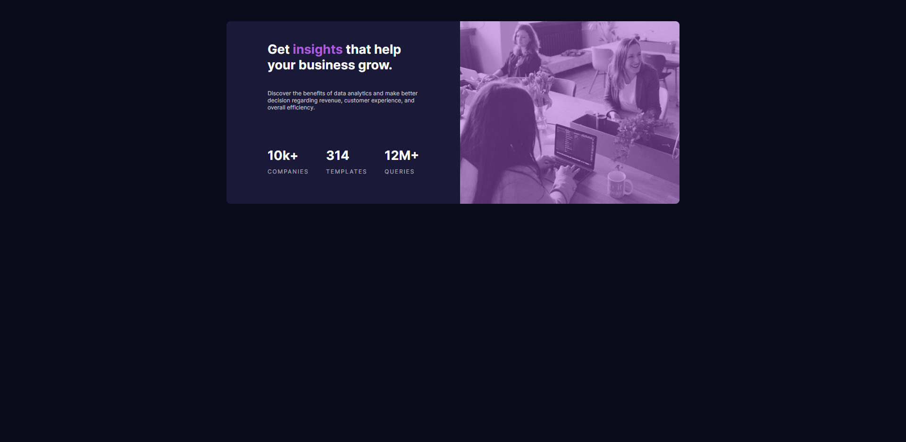

## Overview

This is the 2nd project that i made based on frontendmentors challenge, i made a responsive static website using HTML5,CSS, and media query
maximizing the use of flex box

### The challenge

Users should be able to:

- View the optimal layout depending on their device's screen size

### Screenshot



Desktop-view


Mobile-view

### Links

- Live Site URL: [https://zealous-ritchie-0fd843.netlify.app/

## My process

### Built with

- Semantic HTML5 markup
- CSS custom properties
- Flexbox

**Note: These are just examples. Delete this note and replace the list above with your own choices**

### What I learned

I learn about how to actually overlay picture in this section this is exactly what i did, i need to have exact size of my overlay, then my image should be on HTML with  tags

```css
main .hero {
  position: relative;
}

img {
  width: 100%;
  height: 100%;
  object-fit: cover;
}

main .overlay {
  height: 100%;
  width: 100%;
  z-index: 1;
  background: hsla(277, 64%, 61%, 50%);
  position: absolute;
}
```

### Continued development

I will move on to another project

**Note: Delete this note and the content within this section and replace with your own plans for continued development.**

### Useful resources

- [https://www.flexboxfroggy.com/] - This is helped me to actually learn by doing with interesting UI just like game for flexbox
- [https://www.youtube.com/watch?v=JJSoEo8JSnc&feature=emb_title]- This is a really good quick crash course.

## Author

- Frontend Mentor - [@althafdaa]
